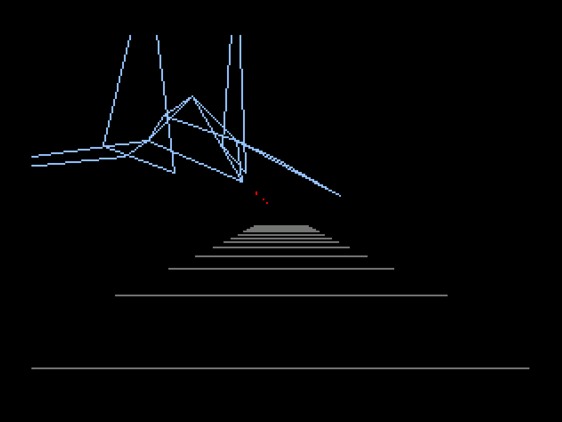

# Starworks -  

**StarWorks** is a 3D rail-shooter game inspired by Star Fox, developed for the **Numworks** calculator, currently in developement.

You can download the latest binary on this link: [v0.1.0](https://github.com/RockingCha1r/StarWorks/releases/tag/v0.1.0). You can install it with [this website](https://my.numworks.com/apps).



## Build the app

You'll need the embedded ARM toolchain and Node.js (works well with the v20.20.2).

<details>
<summary>Downloading dependencies</summary>

### Fedora

```bash
sudo dnf install arm-none-eabi-gcc-cs arm-none-eabi-binutils nodejs
```

### Debian / Ubuntu

```bash
sudo apt install gcc-arm-none-eabi binutils-arm-none-eabi nodejs npm
```

### Arch 

```bash
sudo pacman -S arm-none-eabi-gcc arm-none-eabi-binutils nodejs npm
```

### macOS

```bash
brew install numworks/tap/arm-none-eabi-gcc node
```

</details>

---

After installing the dependencies, use these commands to compile the project:

```bash
make clean
make build
```

and you will find the compiled file in `build/starworks.nwa`.